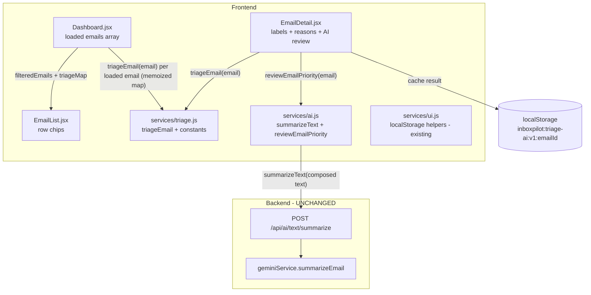

# Design Document: Inbox Triage

## Overview

Inbox Triage adds lightweight, rule-based labels to inbox emails plus an optional, manually-triggered AI priority review on a single email. The entire feature is **frontend-only**. It reuses email data already loaded by the existing screens (`subject`, `from`, `to`, `date`, `labelIds`, `body`, `snippet`) and an existing backend AI endpoint. No backend file is edited, Gmail stays read-only, no new env vars or packages are introduced, and the Vercel build is unaffected.

The design has three layers:

1. **Rule engine** — a new pure module `inboxpilot/client/src/services/triage.js` exporting `triageEmail(email)` and supporting constants. All classification logic lives here so UI components stay thin.
2. **Display layer** — `EmailList.jsx` (chips per row), `Dashboard.jsx` (a client-side triage filter bar + safety copy), and `EmailDetail.jsx` (labels + reasons near the top).
3. **Optional AI review** — a thin frontend wrapper `reviewEmailPriority()` added to `services/ai.js` that reuses `summarizeText()` (POST `/api/ai/text/summarize`) and maps the response into `{ priority, category, reason, suggestedAction }`, cached in localStorage.

The rule engine is the must-have core; it works fully with AI unavailable or never invoked.

### Design Goals

- **Deterministic, pure classification** — same input always yields the same `Triage_Result`; the input object is never mutated.
- **Advisory only** — labels and the AI review never modify Gmail; copy reinforces this.
- **Thin components** — all rules and constants are centralized in `triage.js`; components only render and filter.
- **Visual calm** — reuse existing chip/badge/card patterns (paper/document identity); no loud warning colors; mobile ~375px friendly.
- **Zero infrastructure change** — no new env vars, packages, OAuth scopes, routes, or Gmail writes.

### Key Decision: AI Priority Review IS Shipped (R8)

The optional AI Priority Review (R8) is **shipped**, because reusing an existing backend endpoint is obvious and safe:

- The endpoint `POST /api/ai/text/summarize` (→ `textAiController.summarizeTextHandler` → `geminiService.summarizeEmail(text, "Pasted text")`) already accepts **arbitrary text** via `{ text }`, is **auth-protected** by the same middleware as other AI calls, enforces a 12,000-char limit, and returns a stable shape `{ summary, keyPoints, sentiment }` where `sentiment ∈ {positive, negative, neutral, urgent}`.
- The frontend already wraps it as `summarizeText(text)` in `services/ai.js`.
- The review can therefore be built with **no backend edits**: compose a compact text from the current email's `subject + from + snippet + body`, call `summarizeText`, and map the response to `{ priority, category, reason, suggestedAction }` entirely on the frontend.
- This adds **no new env var, package, OAuth scope, route, or Gmail modification**, satisfying R8.3 and R9. It therefore does NOT fall under the R8.10 skip clause.

The precise mapping is specified in the Components section.

## Architecture



### Module Responsibilities

| Module | Responsibility | New / Changed |
|--------|----------------|---------------|
| `services/triage.js` | Pure rule engine + constants (categories, display labels, priority order, filter set) | **New** |
| `services/ai.js` | Add thin `reviewEmailPriority(email)` wrapper that calls existing `summarizeText` and maps the result | **Changed (frontend only, additive)** |
| `components/EmailList.jsx` | Render up to 3 subtle chips per row from a passed-in triage map | **Changed** |
| `pages/Dashboard.jsx` | Compute triage map once per loaded email; render a separate triage filter bar; client-side filter; safety copy | **Changed** |
| `pages/EmailDetail.jsx` | Render triage labels + reasons near top; render the optional AI review block | **Changed** |
| `App.css` | Add subtle styles for triage chips, filter bar, detail labels/reasons, AI review block | **Changed** |

### Data Flow (Inbox)

1. `Dashboard.jsx` loads emails into `emails` state (existing behavior, unchanged).
2. A `useMemo` builds a `triageMap` (`emailId -> Triage_Result`) by calling `triageEmail(email)` once per email. Recomputed only when `emails` changes.
3. A separate `activeTriageFilter` state drives a `useMemo` `filteredEmails` derived from `emails` + `triageMap` — purely in memory, no fetch.
4. `EmailList` receives `filteredEmails` and the `triageMap` and renders chips per row.

### Separation from Existing Gmail Query Filters (R5.4)

The existing `FILTERS` array (`all/unread/today/attachments/important`) and `handleSelectFilter` re-query Gmail via `loadEmails`. The new triage controls are a **completely separate** control group (`TRIAGE_FILTERS`) that:

- never call `loadEmails` or touch `activeQuery`/`activeFilter`,
- only set `activeTriageFilter` and re-derive `filteredEmails` in memory,
- render in their own `.triage-filter-bar` container distinct from `.filter-chips`.

## Components and Interfaces

### 1. `services/triage.js` (new pure module)

Exported constants:

```js
// Internal category ids (R2 / Glossary)
export const CATEGORY = {
  IMPORTANT: "important",
  NEEDS_REPLY: "needs_reply",
  HAS_TASK: "has_task",
  NEWSLETTER: "newsletter",
  PROMOTION: "promotion",
  RECEIPT: "receipt",
  NOTIFICATION: "notification",
  LOW_PRIORITY: "low_priority",
  POSSIBLE_SPAM: "possible_spam",
};

// User-facing display text (R4.3, Glossary "Triage_Label")
export const DISPLAY_LABELS = {
  important: "Important",
  needs_reply: "Needs reply",
  has_task: "Has task",
  newsletter: "Newsletter",
  promotion: "Promotion",
  receipt: "Receipt",
  notification: "Notification",
  low_priority: "Low priority",
  possible_spam: "Possible spam",
};

// Priority order, highest first (R3.3). Index = rank.
export const PRIORITY_ORDER = [
  "important",
  "needs_reply",
  "has_task",
  "receipt",
  "possible_spam",
  "notification",
  "promotion",
  "newsletter",
  "low_priority",
];

// Actionable categories (R3.1, R3.5)
export const ACTIONABLE = ["important", "needs_reply", "has_task"];

// Dashboard triage filter set (R5.1). id maps to a category, except "all".
export const TRIAGE_FILTERS = [
  { id: "all", label: "All", category: null },
  { id: "important", label: "Important", category: "important" },
  { id: "needs_reply", label: "Needs reply", category: "needs_reply" },
  { id: "has_task", label: "Has task", category: "has_task" },
  { id: "low_priority", label: "Low priority", category: "low_priority" },
  { id: "newsletter", label: "Newsletters", category: "newsletter" },
  { id: "receipt", label: "Receipts", category: "receipt" },
  { id: "possible_spam", label: "Possible spam", category: "possible_spam" },
];
```

Exported function:

```js
/**
 * Classify a single email. Pure: never mutates `email`; same input -> same output.
 * @param {object} email - { subject, from, to, date, labelIds, body, snippet }
 * @returns {{ primary: string|null, labels: string[], score: number, reasons: string[] }}
 */
export function triageEmail(email) { /* see algorithm below */ }
```

#### Normalization (R1.2, R1.3, R1.8)

All field access is null-safe (treat missing/undefined as empty string or empty array). No mutation of `email`.

```js
const str = (v) => (typeof v === "string" ? v : "");
const arr = (v) => (Array.isArray(v) ? v : []);

const subject = str(email?.subject);
const snippet = str(email?.snippet);
const body    = str(email?.body);
const from    = str(email?.from).toLowerCase();
const to      = str(email?.to).toLowerCase();
const labelIds = arr(email?.labelIds);

// Body preview: cap to first 2000 chars to keep matching cheap & deterministic.
const bodyPreview = body.slice(0, 2000);

// Combined lowercase haystack for keyword rules over subject + snippet + body preview.
const haystack = `${subject}\n${snippet}\n${bodyPreview}`.toLowerCase();

// Subject + snippet only (some rules in R2 are scoped to subject/snippet).
const subjSnippet = `${subject}\n${snippet}`.toLowerCase();

// Sender classification
const isNoReply = /no-?reply|notification/.test(from);
const hasImportantLabel = labelIds.some((l) => str(l).toUpperCase() === "IMPORTANT");
```

#### Rule Evaluation (R2)

Each rule pushes its category id into a `matched` Set and a human-readable string into `reasons`. Keyword/phrase sets are defined as constants inside the module:

| Category | Scope | Trigger (case-insensitive) | Extra gate |
|----------|-------|----------------------------|------------|
| `important` (R2.1) | subject + snippet | any of: `urgent`, `important`, `action required`, `deadline`, `due today`, `due tomorrow`, `meeting`, `interview`, `invoice`, `payment`, `security` | AND `isNoReply === false` |
| `important` (R2.2) | labelIds | labelIds includes `IMPORTANT` | — (contributes regardless of sender) |
| `needs_reply` (R2.3) | subject + snippet + body preview | any of: `?`, `please reply`, `let me know`, `can you`, `could you`, `confirm`, `available`, `thoughts?` | — |
| `has_task` (R2.4) | subject + snippet + body preview | any of: `please`, `need to`, `submit`, `review`, `complete`, `send`, `schedule`, `prepare`, `by friday`, `by tomorrow`, `deadline` | — |
| `newsletter` (R2.5) | subject + snippet + body preview | any of: `unsubscribe`, `newsletter`, `digest`, `weekly update` | — |
| `promotion` (R2.6) | subject + snippet + body preview | any of: `sale`, `discount`, `offer`, `deal`, `coupon`, `limited time` | — |
| `receipt` (R2.7) | subject + snippet + body preview | any of: `receipt`, `invoice`, `order`, `payment`, `transaction`, `subscription`, `paid` | — |
| `notification` (R2.8) | from OR subject/snippet | sender contains `noreply`/`no-reply`/`notification`, OR subject/snippet contains `alert`, `verification code`, `security code`, `login attempt` | — |
| `possible_spam` (R2.9) | subject + snippet + body preview | any of: `prize`, `winner`, `free gift`, `claim now`, `urgent money`, `crypto` | — (see optional heuristic below) |
| `low_priority` (R2.10) | derived | assigned `newsletter`/`promotion`/`notification` AND none of `important`/`needs_reply`/`has_task` | applied after primary rules |

Notes:
- R2.1 keyword scope is subject + snippet (`subjSnippet`); R2.2 (`IMPORTANT` label) contributes `important` independently and is NOT gated by sender.
- R2.3/R2.4/R2.5/R2.6/R2.7/R2.9 scope is subject + snippet + body preview (`haystack`).
- The `?` and `thoughts?` triggers for `needs_reply` are substring checks against `haystack`.
- Matching uses simple `haystack.includes(keyword)` against the lowercased keyword list (multi-word phrases like `action required` match as substrings).

##### Optional simple `possible_spam` heuristic

Kept deterministic and simple. In addition to the R2.9 keyword rule, `possible_spam` is also contributed when BOTH simple thresholds hold on the raw (pre-lowercase) `subject + snippet`:

- **Excessive `!`**: count of `!` characters `>= 3`, OR
- **Excessive links**: count of `http` occurrences in `haystack` `>= 4`, OR
- **Shouting caps**: among alphabetic characters in `subject`, uppercase ratio `>= 0.7` AND subject length `>= 10`.

These are pure counts (`(s.match(/!/g) || []).length`, etc.), fully deterministic. If a maintainer prefers the minimal core, the heuristic can be disabled via an internal `const ENABLE_SPAM_HEURISTIC = true;` flag without affecting the keyword rule. Each heuristic match adds a reason like `"Looks spam-like: many exclamation marks"`.

#### Label Selection & Priority (R3)

After collecting the matched Set:

1. **Drop `low_priority` when actionable present (R3.1):** if any of `important`/`needs_reply`/`has_task` is matched, remove `low_priority`.
2. **Order by priority (R3.3):** sort the matched categories by their index in `PRIORITY_ORDER` (ascending = highest first).
3. **Cap to three (R1.4, R3.3, R4.2):** `labels = ordered.slice(0, 3)`.
4. **Primary (R3.4):** `primary = labels[0] ?? null`. When nothing matched, `primary = null`, `labels = []` (R1.7).
5. **`possible_spam` is kept, not removed (R3.2):** it participates in ordering normally and is never used to drop the email from any list; it only contributes a label.

The priority order used to pick the top 3 (R3.3), highest first:

```
important > needs_reply > has_task > receipt > possible_spam > notification > promotion > newsletter > low_priority
```

#### Score Formula (R1.5, R3.5)

`score` is an integer sum of per-category weights over the **matched** categories (computed before the 3-cap so the score reflects all signal). Actionable categories weigh far more than passive ones, guaranteeing R3.5 (any actionable email outranks an email with only low_priority/newsletter/promotion/notification):

```js
const WEIGHTS = {
  important: 100,
  needs_reply: 80,
  has_task: 60,
  receipt: 20,
  possible_spam: 15,
  notification: 8,
  promotion: 5,
  newsletter: 4,
  low_priority: 1,
};
// score = sum of WEIGHTS[c] for each matched category c (integer).
```

Because the smallest actionable weight (60) exceeds the maximum achievable sum of all passive categories (`20+15+8+5+4+1 = 53`), any email with an actionable category always scores higher than any email with only passive categories — satisfying R3.5.

#### `reasons[]` (R1.6, R6/R7)

One short string per matched rule, e.g.:
- `"Subject mentions 'deadline'"`
- `"Gmail marked this Important"`
- `"Contains a question — may need a reply"`
- `"Sender looks automated (no-reply)"`
- `"Mentions 'unsubscribe' — looks like a newsletter"`

Reasons are collected in evaluation order and returned as-is (not capped), so Email_Detail can explain every match (R7.2).

#### Return Shape

```js
{
  primary: "important",                 // category id or null
  labels: ["important", "needs_reply"], // ordered, <= 3
  score: 180,                           // integer
  reasons: ["Subject mentions 'urgent'", "Contains a question — may need a reply"]
}
```

#### Worked Examples

**Example A** — `{ subject: "URGENT: invoice payment due tomorrow", snippet: "Can you confirm?", from: "billing@acme.com", labelIds: ["IMPORTANT","INBOX"], body: "Please review and confirm." }`

- `important`: matches `urgent`/`invoice`/`payment`/`due tomorrow` in subject AND sender not no-reply → matched; also `IMPORTANT` label → matched.
- `needs_reply`: `can you`, `confirm`, `?` → matched.
- `has_task`: `please`, `review`, `confirm` (via `confirm`? no — `confirm` is needs_reply), `review`/`please` → matched.
- `receipt`: `invoice`/`payment` → matched.
- Ordering: `important > needs_reply > has_task > receipt`; cap to 3 → `["important","needs_reply","has_task"]`.
- `primary = "important"`. `score = 100+80+60+20 = 260`.

**Example B** — `{ subject: "Your weekly digest", snippet: "Unsubscribe anytime", from: "news@noreply.site.com", labelIds: ["INBOX"], body: "" }`

- `newsletter`: `digest`/`unsubscribe` → matched.
- `notification`: sender contains `noreply` → matched.
- No actionable categories → `low_priority` added (R2.10).
- Ordering: `notification > newsletter > low_priority`; cap to 3 → `["notification","newsletter","low_priority"]`.
- `primary = "notification"`. `score = 8+4+1 = 13`.

**Example C** — `{ subject: "Hello", snippet: "", body: "Just saying hi", from: "friend@x.com", labelIds: [] }`

- No rule matches → `primary = null`, `labels = []`, `score = 0`, `reasons = []` (R1.7).

### 2. `services/ai.js` — add `reviewEmailPriority` (frontend-only, additive)

A thin wrapper that reuses the existing `summarizeText` (no backend change). It composes a compact text, calls the endpoint, and maps the result. It also integrates the rule-based primary for category/action derivation.

```js
import { triageEmail, DISPLAY_LABELS, CATEGORY } from "./triage.js";

const TEXT_LIMIT = 12000; // matches backend MAX_TEXT_LENGTH

/** Compose compact text from current email fields (R8.3: only these fields are sent). */
function composeEmailText(email) {
  const subject = email?.subject || "(no subject)";
  const from = email?.from || "Unknown sender";
  const snippet = email?.snippet || "";
  const body = email?.body || "";
  const composed =
    `Subject: ${subject}\nFrom: ${from}\n` +
    (snippet ? `Snippet: ${snippet}\n` : "") +
    `\n${body}`;
  return composed.slice(0, TEXT_LIMIT);
}

const SENTIMENT_TO_PRIORITY = {
  urgent: "high",
  negative: "medium",
  neutral: "low",
  positive: "low",
};

const SUGGESTED_ACTION = {
  important: "Review this soon — it may need your attention.",
  needs_reply: "Consider replying.",
  has_task: "Add the action item to your tasks.",
  receipt: "File this for your records.",
  notification: "No action needed — informational.",
  promotion: "Optional — read only if interested.",
  newsletter: "Read later when you have time.",
  low_priority: "Low priority — handle later.",
  possible_spam: "Be cautious — this looks spam-like.",
};

/**
 * Optional AI priority review for a single email (R8).
 * Reuses summarizeText (POST /api/ai/text/summarize). No backend change.
 * Returns { priority, category, reason, suggestedAction }.
 */
export async function reviewEmailPriority(email) {
  const text = composeEmailText(email);
  const res = await summarizeText(text); // { summary, keyPoints, sentiment }

  // Rule-based primary informs category + action.
  const triage = triageEmail(email);
  const primary = triage.primary;

  // priority: prefer sentiment; if rule says actionable but sentiment is low, lift to medium.
  let priority = SENTIMENT_TO_PRIORITY[res?.sentiment] || "low";
  const isActionable = primary && ["important", "needs_reply", "has_task"].includes(primary);
  if (isActionable && priority === "low") priority = "medium";

  const category = primary ? DISPLAY_LABELS[primary] : (res?.sentiment || "General");

  // reason: first sentence of the AI summary, trimmed.
  const summaryText = (res?.summary || "").trim();
  const reason = summaryText
    ? (summaryText.split(/(?<=[.!?])\s/)[0] || summaryText).slice(0, 200)
    : "No clear priority signal found.";

  const suggestedAction = primary
    ? (SUGGESTED_ACTION[primary] || "Review when convenient.")
    : "Review when convenient.";

  return { priority, category, reason, suggestedAction };
}
```

Mapping summary (R8.4):
- **priority** ← `sentiment`: `urgent→high`, `negative→medium`, `neutral/positive→low`; lifted to `medium` if the rule-based primary is actionable but sentiment was low. Always one of `high|medium|low`.
- **category** ← rule-based primary's display text (e.g., "Needs reply"), falling back to the sentiment word when no rule matched.
- **reason** ← first sentence of the AI `summary`, trimmed to ≤200 chars.
- **suggestedAction** ← short action derived from the rule-based primary category.

### 3. `EmailList.jsx` — chips per row (R4)

`EmailList` accepts a new optional prop `triageMap` (`{ [emailId]: Triage_Result }`). Inside the row, after `.email-snippet`, render chips when the email has labels:

```jsx
// new prop: triageMap = {}
const triage = triageMap[email.id];
{triage && triage.labels.length > 0 && (
  <span className="triage-chips" aria-label="Triage labels">
    {triage.labels.map((cat) => (
      <span
        key={cat}
        className={`triage-chip triage-${cat}`}
      >
        {DISPLAY_LABELS[cat]}
      </span>
    ))}
  </span>
)}
```

- At most 3 chips (the engine already caps `labels`) (R4.2).
- Display text via `DISPLAY_LABELS` (R4.3).
- No chips element rendered when `labels` is empty (R4.6).
- `possible_spam` uses `.triage-possible_spam` — visible but calm (a muted amber border/text, never a filled red alert) (R4.5).
- Import `DISPLAY_LABELS` from `../services/triage.js`. Default `triageMap = {}` keeps the component backward-compatible.

### 4. `Dashboard.jsx` — triage filter bar + memoized triage map (R5, R6)

New state and derived values (added without touching existing Gmail filter logic):

```js
import { useMemo } from "react";
import { triageEmail, TRIAGE_FILTERS } from "../services/triage.js";

const [activeTriageFilter, setActiveTriageFilter] = useState("all");

// Compute triage once per loaded email; recompute only when emails change.
const triageMap = useMemo(() => {
  const map = {};
  for (const e of emails) map[e.id] = triageEmail(e);
  return map;
}, [emails]);

// Client-side filtered list (no fetch).
const filteredEmails = useMemo(() => {
  if (activeTriageFilter === "all") return emails;
  return emails.filter((e) => triageMap[e.id]?.labels.includes(activeTriageFilter));
}, [emails, triageMap, activeTriageFilter]);

// Per-filter counts (R5.5) — straightforward, so included.
const triageCounts = useMemo(() => {
  const counts = {};
  for (const f of TRIAGE_FILTERS) {
    counts[f.id] =
      f.id === "all"
        ? emails.length
        : emails.filter((e) => triageMap[e.id]?.labels.includes(f.category)).length;
  }
  return counts;
}, [emails, triageMap]);
```

Render: a **separate** filter bar placed below the existing `.filter-chips` group and above `.list-meta`, clearly distinct (its own container `.triage-filter-bar` + a small heading "Triage"). Selecting a triage filter only updates `activeTriageFilter` — it never calls `loadEmails` (R5.4).

```jsx
<div className="triage-filter-bar" role="group" aria-label="Triage filters">
  <span className="triage-filter-label">Triage</span>
  {TRIAGE_FILTERS.map((f) => (
    <button
      key={f.id}
      type="button"
      className={`triage-filter-chip ${activeTriageFilter === f.id ? "active" : ""}`}
      aria-pressed={activeTriageFilter === f.id}
      onClick={() => setActiveTriageFilter(f.id)}
    >
      {f.label}
      <span className="triage-filter-count">{triageCounts[f.id]}</span>
    </button>
  ))}
</div>
<p className="inbox-safety-note">
  Labels are suggestions based on message content. Gmail is not modified.
</p>
```

- The safety copy (R6.1) is rendered here, near the triage bar.
- `EmailList` is passed `filteredEmails` and `triageMap`:

```jsx
<EmailList
  emails={filteredEmails}
  loading={emailsLoading}
  onEmailClick={handleEmailClick}
  activeQuery={activeFilter ? "" : activeQuery}
  onClearSearch={handleClearSearch}
  triageMap={triageMap}
/>
```

- **Empty state (R5.6):** when `activeTriageFilter !== "all"` and `filteredEmails.length === 0` (while not loading and emails exist), Dashboard renders `"No messages match this filter."` instead of `EmailList`'s generic empty state. This is a small conditional in Dashboard so the triage-specific copy is exact:

```jsx
{activeTriageFilter !== "all" && !emailsLoading && emails.length > 0 && filteredEmails.length === 0 ? (
  <p className="triage-empty">No messages match this filter.</p>
) : (
  <EmailList ... />
)}
```

### 5. `EmailDetail.jsx` — labels + reasons + AI review (R7, R8)

Compute triage from the loaded `email` (after it loads), memoized:

```js
import { triageEmail, DISPLAY_LABELS } from "../services/triage.js";
import { reviewEmailPriority } from "../services/ai.js";

const triage = useMemo(() => (email ? triageEmail(email) : null), [email]);
```

**Triage panel near the top (R7.1, R7.2, R7.3):** rendered inside `.email-content`, after `.email-detail-subject` and before `.email-meta`, so it does not touch the `.ai-panel` aside:

```jsx
{triage && triage.labels.length > 0 && (
  <div className="triage-detail">
    <div className="triage-detail-chips">
      {triage.labels.map((cat) => (
        <span key={cat} className={`triage-chip triage-${cat}`}>
          {DISPLAY_LABELS[cat]}
        </span>
      ))}
    </div>
    {triage.reasons.length > 0 && (
      <ul className="triage-reasons">
        {triage.reasons.map((r, i) => <li key={i}>{r}</li>)}
      </ul>
    )}
  </div>
)}
```

The existing Summarize / Extract tasks / Suggest reply panel and its localStorage history are untouched (R7.3, R9.5).

**AI Priority Review block (R8):** an additional, clearly separate section inside the `.ai-panel` aside (below the existing actions, or its own subsection). It is manually triggered.

State:

```js
const [review, setReview] = useState(null);
const [reviewLoading, setReviewLoading] = useState(false);
const [reviewError, setReviewError] = useState(null);
```

Local storage cache (separate namespace from existing `inboxpilot:ai-results`):

- Key: `inboxpilot:triage-ai:v1:{emailId}` (R8.7).
- Value: `{ result: { priority, category, reason, suggestedAction }, generatedAt }`.
- Helpers follow the same defensive style as `services/ui.js` (probe `storageAvailable`, try/catch, never throw). They will be small local functions in EmailDetail (or co-located in `services/ui.js` as `loadTriageReview`/`saveTriageReview`/`clearTriageReview` using the new prefix). To keep `ui.js` cohesive, add three thin helpers there mirroring the existing pattern but with prefix `inboxpilot:triage-ai:v1:`.

Hydration: in the existing per-`id` reset effect, also load any cached review and set `review` (R8.8). Reset `review`/errors when `id` changes so results never bleed across emails.

Handler:

```js
async function handleReviewPriority() {
  if (reviewLoading) return;
  setReviewLoading(true);
  setReviewError(null);
  try {
    const result = await reviewEmailPriority(email);
    setReview(result);
    saveTriageReview(id, result); // writes inboxpilot:triage-ai:v1:{id}
  } catch (err) {
    setReviewError(friendlyError(err, "We couldn't review this email's priority."));
  } finally {
    setReviewLoading(false);
  }
}
```

UI states:
- **Trigger (R8.1, R8.2):** a `.btn-ai` "Review priority" button; never auto-fires (only on click).
- **Loading (R8.5):** spinner + "Reviewing priority…".
- **Error + retry (R8.6):** reuse `.ai-error` pattern with a Retry button calling `handleReviewPriority`; no Gmail call ever occurs.
- **Result (R8.4):** a `.ai-result-section`-style block showing `priority` (as a subtle badge), `category`, `reason`, `suggestedAction`, plus a "Clear" control.
- **Disclaimer (R8.9):** static line `"AI review is a suggestion. Gmail is not modified."`

## Data Models

### Triage_Result (returned by `triageEmail`)

```ts
type CategoryId =
  | "important" | "needs_reply" | "has_task" | "newsletter"
  | "promotion" | "receipt" | "notification" | "low_priority" | "possible_spam";

interface TriageResult {
  primary: CategoryId | null;   // first of labels, or null when nothing matched
  labels: CategoryId[];         // ordered by priority, length 0..3
  score: number;                // integer; actionable categories dominate
  reasons: string[];            // one short string per matched rule
}
```

### AI Review Result (returned by `reviewEmailPriority`)

```ts
interface AiReviewResult {
  priority: "high" | "medium" | "low";
  category: string;       // display label or sentiment word
  reason: string;         // one sentence, <= 200 chars
  suggestedAction: string;// one sentence
}
```

### LocalStorage cache entry (`inboxpilot:triage-ai:v1:{emailId}`)

```ts
interface TriageReviewCacheEntry {
  result: AiReviewResult;
  generatedAt: number; // Date.now()
}
```

### Email input shape (already provided by existing services — read-only)

```ts
interface Email {
  id: string;
  subject?: string;
  from?: string;
  to?: string;
  date?: string;
  labelIds?: string[]; // may include "IMPORTANT"
  body?: string;
  snippet?: string;
  isUnread?: boolean;
}
```

## Correctness Properties

*A property is a characteristic or behavior that should hold true across all valid executions of a system — essentially, a formal statement about what the system should do. Properties serve as the bridge between human-readable specifications and machine-verifiable correctness guarantees.*

The `triageEmail` function is a pure function over structured input, which makes it an ideal target for property-based testing. The properties below were derived from the prework analysis and deduplicated so each provides unique validation value. (Note on test runners: the client currently has no test framework configured — see Testing Strategy. These properties are written so they can be executed as property-based tests if a runner is added, and otherwise drive the manual verification checklist.)

### Property 1: Well-formed Triage_Result

*For any* email input (including ones with missing, null, or undefined fields), `triageEmail(email)` returns an object where `primary` is a category id or `null`, `labels` is an array of at most three category ids, `score` is an integer, and `reasons` is an array of strings.

**Validates: Requirements 1.1, 1.3, 1.4, 1.5, 1.6**

### Property 2: Case-insensitive classification

*For any* email, classifying the original email and classifying a copy whose text fields (`subject`, `snippet`, `body`, `from`, `to`) have had their letter case flipped produces the same set of `labels`.

**Validates: Requirements 1.2**

### Property 3: No match yields empty classification

*For any* email whose `subject`, `snippet`, and `body` contain none of the rule keywords, whose `labelIds` do not include `IMPORTANT`, and whose `from` is not an automated/no-reply address, `triageEmail` returns `primary === null` and `labels === []`.

**Validates: Requirements 1.7**

### Property 4: Purity and no mutation

*For any* email, calling `triageEmail` twice returns deeply equal results, and the input email object is deeply equal to a snapshot taken before the call (the function never mutates its input).

**Validates: Requirements 1.8**

### Property 5: Per-category trigger assignment

*For any* neutral base email and *for any* category among `needs_reply`, `has_task`, `newsletter`, `promotion`, `receipt`, `notification`, `possible_spam`, injecting one of that category's defined trigger keywords causes that category to be present in the matched categories. Additionally, *for any* email assigned `newsletter`, `promotion`, or `notification` and no actionable category, `low_priority` is present in the matched categories.

**Validates: Requirements 2.3, 2.4, 2.5, 2.6, 2.7, 2.8, 2.9, 2.10**

### Property 6: Important sender gate and IMPORTANT label path

*For any* email containing an `important` trigger keyword: when the sender is a no-reply address and `labelIds` does not include `IMPORTANT`, the `important` category is NOT assigned via the keyword rule; when the sender is not a no-reply address, the `important` category IS assigned. Independently, *for any* email whose `labelIds` include `IMPORTANT`, the `important` category is assigned regardless of sender.

**Validates: Requirements 2.1, 2.2**

### Property 7: Actionable categories exclude low_priority

*For any* email that matches both an actionable category (`important`, `needs_reply`, or `has_task`) and one of `newsletter`/`promotion`/`notification`, the returned `labels` does not contain `low_priority`.

**Validates: Requirements 3.1**

### Property 8: Priority ordering and three-label cap

*For any* email, the returned `labels` equals the matched categories sorted by the defined priority order (highest first) and truncated to the first three, so labels are always in non-increasing priority and number at most three.

**Validates: Requirements 3.3, 1.4**

### Property 9: Primary is the first label

*For any* email with at least one matching category, `primary` equals `labels[0]`.

**Validates: Requirements 3.4**

### Property 10: Actionable score dominates passive score

*For any* email that matches an actionable category and *for any* email that matches only passive categories (`low_priority`, `newsletter`, `promotion`, `notification`), the actionable email's `score` is strictly greater than the passive-only email's `score`.

**Validates: Requirements 3.5**

### Property 11: possible_spam is retained without removal

*For any* email matching a `possible_spam` trigger, `possible_spam` appears among the matched categories and the returned result contains only the advisory fields (`primary`, `labels`, `score`, `reasons`) with no field that removes or deletes the email.

**Validates: Requirements 3.2**

### Property 12: AI review mapping is well-formed

*For any* sentiment value (`positive`, `negative`, `neutral`, `urgent`) returned by the summarize endpoint and *for any* email, the pure mapping helper used by `reviewEmailPriority` returns `priority` ∈ `{high, medium, low}`, and non-empty string values for `category`, `reason`, and `suggestedAction`. (Requires extracting the mapping into a pure helper, e.g. `mapReview(summaryResponse, email)`.)

**Validates: Requirements 8.4**

## Error Handling

### Rule engine (`triage.js`)

- **Null-safe by construction (R1.3):** every field is read through `str()`/`arr()` guards; missing/undefined/null fields become empty. The function has no I/O and cannot throw on malformed input. It always returns a well-formed `Triage_Result`.
- **No exceptions surfaced to UI:** because the engine cannot throw for any object input, callers (`Dashboard`, `EmailDetail`) need no try/catch around `triageEmail`.

### Display layer

- **EmailList / EmailDetail:** if `triageMap[id]` is missing (e.g., race before memo settles), the chip block is simply not rendered (guarded by `triage && triage.labels.length > 0`). No crash, no empty wrapper.
- **Dashboard filter:** filtering uses optional chaining (`triageMap[e.id]?.labels.includes(...)`); an email missing from the map is treated as non-matching.

### AI Priority Review (`reviewEmailPriority` + EmailDetail)

- **Network/provider errors (R8.6):** `summarizeText` rejections are caught in `handleReviewPriority`, converted via the existing `friendlyError` helper, and shown in an `.ai-error` block with a Retry button. The existing `friendlyError` already maps 429/5xx/network cases to calm copy.
- **Unexpected response shape:** the mapping uses optional chaining and defaults (`res?.sentiment`, `res?.summary || ""`), so a partial response still yields a valid `AiReviewResult` (priority defaults to `low`, reason defaults to a safe sentence).
- **localStorage failures (R8.7):** save/load helpers mirror the proven `services/ui.js` pattern — they probe `storageAvailable()` and wrap access in try/catch, degrading silently (no cache, no crash) in private mode or when quota is exceeded.
- **No Gmail mutation on any path (R8.6, R9.1):** the only network call is the read-only summarize endpoint; there is no Gmail write code anywhere in this feature.

## Testing Strategy

### Test-runner reality check

`inboxpilot/client/package.json` defines only `dev`, `build`, and `preview` scripts and has **no test framework** (no Vitest/Jest, no testing-library) in dependencies or devDependencies. Per R9.4 we must **not add new packages**. Therefore this feature does **not** introduce a test runner or any test dependency.

Two-track strategy that respects that constraint:

#### Track A — Property/unit tests (only if a runner already exists; otherwise deferred)

The properties above are written to be runnable with a property-based library (e.g., fast-check) **if and only if** a runner is later added outside this feature's scope. They would target the pure `triage.js` engine and the extracted `mapReview` helper:

- Each property test runs **≥100 iterations**.
- Each test is tagged: **Feature: inbox-triage, Property {N}: {property text}**.
- Each correctness property maps to a **single** property-based test.
- Generators must cover edge cases (R1.3): undefined/null/missing fields, empty strings, non-ASCII text, very long bodies, mixed-case keywords, multiple simultaneous triggers, and senders with/without no-reply patterns.

Because no runner is configured and we cannot add one here, Track A is documented but **not implemented** in this feature.

#### Track B — Lightweight self-checks + manual verification (this feature's actual coverage)

Since no test runner is available, correctness is validated by:

1. **Build verification (R11.1):** `npm run build --prefix inboxpilot/client` completes without errors.
2. **Pure-function design** keeps `triage.js` easy to reason about and (later) easy to test; the worked examples in this design double as expected-output fixtures for manual checking in the browser console (`import { triageEmail } from './services/triage.js'`).
3. **Self-consistency checks** that are cheap and dependency-free can be asserted at module load in dev only (optional `console.assert`), e.g. every `CategoryId` has a `DISPLAY_LABELS` entry and appears in `PRIORITY_ORDER`. These add no packages.
4. **Manual verification checklist (R11.2–R11.4):**
   - Inbox shows ≤3 calm chips per row; spam chip is visible but not alarming; rows with no match show no chips.
   - Triage filter bar is visually separate from the Gmail filter chips; selecting a triage filter does **not** trigger a network request (verify in Network tab).
   - "All" shows all loaded emails; each filter shows only matching emails; counts are correct; empty filter shows "No messages match this filter."
   - Safety copy is present on the inbox.
   - Email Detail shows labels + reasons near the top; Summarize/Extract tasks/Suggest reply still work unchanged.
   - "Review priority" only fires on click; shows loading, then a result with priority/category/reason/suggestedAction; failure shows error + retry; result persists across reload (localStorage); disclaimer present.
   - Layout is usable at ~375px; no new console errors.

### What is NOT property-tested

- UI rendering, chip styling, filter wiring, loading/error visuals, and the static safety/disclaimer strings (R4.x display, R5.x wiring, R6, R7.x rendering, R8.1/8.2/8.5/8.6/8.9) — verified manually.
- Read-only/config-safety and build/regression guarantees (R9, R11) — verified by build + code inspection.
- The summarize endpoint behavior itself (external/AI) — out of scope; we only test our pure mapping.

## Provider-Switch Report (Inspection-Only — No Code Change in This Feature)

> This section is a **written, inspection-only deliverable** required by R10. **No provider change, backend edit, env change, or package change is made by the inbox-triage feature.** Everything described as a "switch" below is a **future** task.

### 1. Where the current AI provider is configured (R10.1)

The AI provider is configured entirely in **`inboxpilot/server/services/geminiService.js`**:
- Imports the SDK: `const { GoogleGenerativeAI } = require("@google/generative-ai");`
- Reads model from `process.env.GEMINI_MODEL` (default `"gemini-1.5-flash"`).
- `getModel()` reads `process.env.GEMINI_API_KEY`, instantiates `new GoogleGenerativeAI(apiKey)`, and returns `genAI.getGenerativeModel({ model })`.
- All generation goes through `model.generateContent(prompt)` inside `summarizeEmail`, `extractTasks`, `suggestReply`, and `simplifyText`. JSON cleanup is centralized in `parseJSON`.

### 2. Files that would need changes to switch later (R10.2)

- **`server/services/geminiService.js` — definitely (core).** This is the only file that imports the SDK and knows about the provider. Swapping providers means changing the client construction and the single generation call.
- **Consumers need NO change (verified):**
  - `server/controllers/aiController.js` imports only `{ summarizeEmail, extractTasks, suggestReply }` from `geminiService` and depends solely on their input args and return shapes.
  - `server/controllers/textAiController.js` imports only `{ summarizeEmail, extractTasks, suggestReply, simplifyText }` and likewise depends only on signatures/return shapes.
  - As long as a new provider implementation keeps the **same exported function names, argument order, and return shapes** (`summarizeEmail`/`extractTasks` → JSON objects; `suggestReply`/`simplifyText` → trimmed strings), the controllers require no edits.
- **Routes are unaffected:** `routes/aiRoutes.js` and `routes/textAiRoutes.js` reference controller handlers, not the provider.

### 3. Abstraction quality (R10.3)

The backend AI code is **already well abstracted** behind a single service module (`geminiService.js`) with four cohesive exported functions and a shared `parseJSON` helper. It is straightforward to abstract behind a single seam. **Recommendation (future):** introduce a tiny provider-agnostic adapter inside `geminiService.js` — e.g. a private `generateText(prompt)` (and/or `generateJSON(prompt)`) function that wraps whatever SDK is active. Then `summarizeEmail`/`extractTasks`/`suggestReply`/`simplifyText` call `generateText`/`generateJSON` instead of `model.generateContent` directly, so only that one adapter changes when the provider changes. This keeps prompts and JSON parsing provider-independent.

### 4. Environment variables currently used (R10.4)

- `GEMINI_API_KEY` — provider API key.
- `GEMINI_MODEL` — model name (optional; defaults to `gemini-1.5-flash`).

**In THIS feature, `.env`, `.env.example`, and these variable names are left unchanged, and no new variables are added (R9.3).**

### 5. Safe future plan to swap to a free OpenAI-compatible / free-tier provider (R10.5)

A future migration (e.g., to an OpenAI-compatible free endpoint such as an OpenRouter free model, or staying on a Gemini free tier) can be done safely as follows — all steps are FUTURE, not part of this feature:

1. Keep the four exported function **signatures and return shapes identical** so controllers/routes stay untouched.
2. Add the provider-agnostic `generateText`/`generateJSON` adapter (section 3) and route the four functions through it.
3. Swap the SDK/client construction inside `geminiService.js`: change the imported client, the base URL (for OpenAI-compatible providers), the model name, and the API key env var.
4. Add the new env var to **`.env.example`** in that future task (and the real value only to `.env`), without removing usage docs.
5. Keep the existing prompt text and `parseJSON` logic; only the transport changes.
6. Test each endpoint (`/ai/summarize`, `/ai/extract-tasks`, `/ai/suggest-reply`, and the `/ai/text/*` variants) to confirm the response shapes match before removing the old client.

### 6. Exact files likely needed for the future switch (R10.2, R10.5) — FUTURE ONLY

- **`server/services/geminiService.js`** — definitely (client construction + generation call + optional adapter).
- **`.env` / `.env.example`** — future (new provider key/model variables).
- **`server/package.json` / `package-lock.json`** — possibly, only if the new provider ships a different SDK (e.g., `openai`).

These are explicitly **FUTURE** changes and are **NOT** made by the inbox-triage feature.

## Non-Regression & Safety Summary (R9, R11)

- **No backend files edited.** Triage and the AI review are entirely frontend. The AI review reuses the existing `POST /api/ai/text/summarize` endpoint and the existing `summarizeText` wrapper.
- **Gmail stays read-only (R9.1, R9.2).** No delete/archive/label/mark-read/modify/send code is added; OAuth scope is unchanged.
- **No env/package changes (R9.3, R9.4).** No new environment variables, no new packages; `.env`, `.env.example`, `package.json`, and `package-lock.json` are untouched.
- **Existing AI features preserved (R9.5).** The Summarize/Extract tasks/Suggest reply panel and its `inboxpilot:ai-results` localStorage history are unchanged; the triage review uses a separate `inboxpilot:triage-ai:v1` namespace.
- **Triage works without AI (R9.6).** The rule engine is independent of any AI call.
- **Vercel build unaffected (R9.7, R11.1).** Only additive frontend modules/styles; the build command and config are unchanged.

## Styling (App.css additions, subtle/paper identity)

New classes (mobile ~375px friendly; reuse existing tokens `--surface`, `--surface-2`, `--border`, `--border-strong`, `--text-secondary`, `--text-faint`, `--radius-sm`, `--radius-pill`; no loud warning fills):

- `.triage-chips` — inline flex, small gap, wraps; sits under `.email-snippet` in a row.
- `.triage-chip` — small pill: `font-size: ~0.68rem`, `padding: 1px 8px`, `border: 1px solid var(--border)`, `background: var(--surface-2)`, `color: var(--text-secondary)`, `border-radius: var(--radius-pill)`. Mirrors `.label-tag`/`.ai-result-badge` calm style (R4.4).
- Per-category accents are **subtle** (a slightly tinted border/text only), e.g. `.triage-important` and `.triage-needs_reply` use a quiet primary-tinted border; passive categories stay neutral gray.
- `.triage-possible_spam` — visible but calm (muted amber text + amber border on `--surface-2`, never a filled red background) (R4.5).
- `.triage-filter-bar` — flex row, wraps, with a small `.triage-filter-label` ("Triage") to distinguish it from `.filter-chips` (R5.4).
- `.triage-filter-chip` — like `.filter-chip` but visually lighter; `.active` uses a soft fill (e.g., `--primary-soft`) rather than the strong filled primary used by Gmail chips, reinforcing the separation. Includes `.triage-filter-count` as a small muted number.
- `.triage-empty` — quiet centered line for "No messages match this filter."
- `.triage-detail` — container near top of the email sheet; `.triage-detail-chips` reuses `.triage-chip`; `.triage-reasons` is a small muted `<ul>` (`color: var(--text-secondary)`, `font-size: ~0.8rem`).
- AI review block: reuse `.ai-result-section`, `.ai-result-head`, `.ai-loading`, `.ai-error`, `.btn-chip`. Add `.ai-priority-badge` with three calm variants `.priority-high`/`.priority-medium`/`.priority-low` (subtle tinted text/border, consistent with existing `.priority-badge` tones, no alarming red).

All additions use existing CSS variables and follow the existing paper/document aesthetic; no new fonts, colors outside the token set, or animations beyond the existing spinner.
