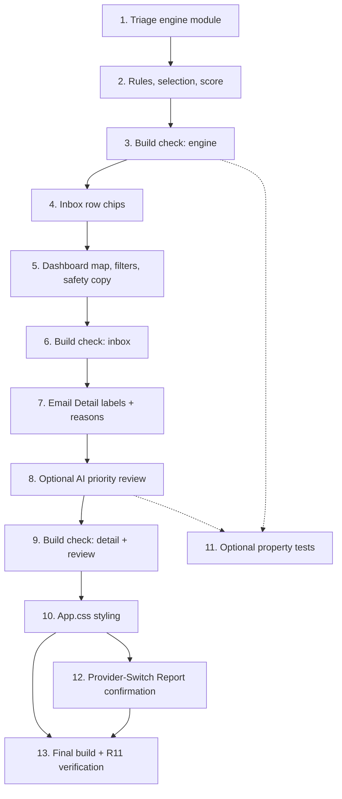

# Implementation Plan: Inbox Triage

## Overview

This plan implements the frontend-only Inbox Triage feature in incremental, dependency-ordered steps. The pure rule engine (`triage.js`) is built first since every other layer depends on it, followed by inbox display integration (rows, filter bar, safety copy), then the Email Detail labels/reasons panel, then the optional AI priority review (reusing the existing summarize endpoint), then styling, and finally a full build plus the R11 manual verification checklist.

All work is confined to the client. No backend file is edited, no new packages or environment variables are introduced, no OAuth scope changes, and no Gmail write is performed. The Provider-Switch Report (R10) is an inspection-only deliverable already written in `design.md`; the only task touching it confirms its accuracy with no code change.

Verification uses `npm run build --prefix inboxpilot/client` (no test runner exists, and none may be added). The pure `triageEmail` and `mapReview` helpers are extracted as pure functions so they are testable-in-principle; the property-based test task is explicitly optional and skippable because it depends on a pre-existing runner, which is not present.

## Task Dependency Graph



```json
{
  "waves": [
    { "wave": 1, "tasks": ["1"] },
    { "wave": 2, "tasks": ["2"] },
    { "wave": 3, "tasks": ["3"] },
    { "wave": 4, "tasks": ["4"] },
    { "wave": 5, "tasks": ["5"] },
    { "wave": 6, "tasks": ["6"] },
    { "wave": 7, "tasks": ["7"] },
    { "wave": 8, "tasks": ["8"] },
    { "wave": 9, "tasks": ["9", "11"] },
    { "wave": 10, "tasks": ["10"] },
    { "wave": 11, "tasks": ["12"] },
    { "wave": 12, "tasks": ["13"] }
  ]
}
```

## Tasks

- [x] 1. Create the pure triage rule engine module
  - Create NEW file `inboxpilot/client/src/services/triage.js`
  - Export constants `CATEGORY`, `DISPLAY_LABELS`, `PRIORITY_ORDER`, `ACTIONABLE`, and `TRIAGE_FILTERS` exactly as specified in design "Components and Interfaces §1"
  - Implement null-safe normalization helpers (`str`, `arr`), `bodyPreview` cap (2000 chars), `haystack`, `subjSnippet`, `isNoReply`, and `hasImportantLabel` per design "Normalization"
  - Implement `triageEmail(email)` returning `{ primary, labels, score, reasons }`; pure, never mutating the input
  - _Requirements: 1.1, 1.2, 1.3, 1.5, 1.6, 1.8_
  - _Design: Components §1 (Normalization, Return Shape, Data Models: Triage_Result)_

- [x] 2. Implement category rules, priority/label selection, and score
  - [x] 2.1 Implement the R2 category trigger rules in `triageEmail`
    - Add keyword/phrase constant sets and evaluate `important` (subject+snippet, gated by `isNoReply === false`), the `IMPORTANT` labelId path (ungated), `needs_reply`, `has_task`, `newsletter`, `promotion`, `receipt`, `notification`, and `possible_spam` over the correct scopes per the design rule table
    - Add the derived `low_priority` rule (newsletter/promotion/notification AND no actionable category)
    - Add the deterministic `possible_spam` heuristic behind an internal `ENABLE_SPAM_HEURISTIC` flag (excessive `!`, excessive `http`, shouting caps) with pure counts
    - Push one short human-readable string into `reasons` per matched rule
    - _Requirements: 2.1, 2.2, 2.3, 2.4, 2.5, 2.6, 2.7, 2.8, 2.9, 2.10_
    - _Design: Components §1 (Rule Evaluation, Optional possible_spam heuristic, reasons[])_

  - [x] 2.2 Implement label selection, priority ordering, and primary
    - Drop `low_priority` when any actionable category is present
    - Order matched categories by `PRIORITY_ORDER` (highest first), cap `labels` to the top three
    - Set `primary = labels[0] ?? null`; return `primary = null`, `labels = []` when nothing matches
    - Keep `possible_spam` in ordering without removing the email or marking deletion
    - _Requirements: 1.4, 1.7, 3.1, 3.2, 3.3, 3.4_
    - _Design: Components §1 (Label Selection & Priority)_

  - [x] 2.3 Implement the integer score formula
    - Sum per-category `WEIGHTS` over all matched categories (before the 3-cap) so actionable categories dominate passive-only emails
    - Return `score` as an integer
    - _Requirements: 1.5, 3.5_
    - _Design: Components §1 (Score Formula)_

- [x] 3. Build check — engine compiles
  - Run `npm run build --prefix inboxpilot/client` and confirm it completes without errors
  - Optionally spot-check the three worked examples (A/B/C) from the design against `triageEmail` output via the dev console
  - _Requirements: 11.1_
  - _Design: Testing Strategy (Track B, build verification)_

- [x] 4. Render triage chips on inbox rows
  - Modify `inboxpilot/client/src/components/EmailList.jsx`
  - Add an optional `triageMap = {}` prop (keeps the component backward-compatible)
  - Import `DISPLAY_LABELS` from `../services/triage.js`
  - After `.email-snippet`, render a `.triage-chips` wrapper with up to three `.triage-chip triage-{cat}` chips using `DISPLAY_LABELS`; render nothing when the email has no labels
  - Ensure `possible_spam` uses its dedicated class for a visible-but-calm treatment
  - _Requirements: 4.1, 4.2, 4.3, 4.5, 4.6_
  - _Design: Components §3 (EmailList chips per row)_

- [x] 5. Wire triage map, filter bar, and safety copy into the Dashboard
  - [x] 5.1 Compute the memoized triage map and filtered list
    - Modify `inboxpilot/client/src/pages/Dashboard.jsx`
    - Import `triageEmail` and `TRIAGE_FILTERS` from `../services/triage.js`
    - Add `activeTriageFilter` state and `useMemo`-derived `triageMap` (one `triageEmail` call per loaded email, recomputed only when `emails` change)
    - Add `useMemo`-derived `filteredEmails` (in-memory only, no fetch) and `triageCounts`
    - Pass `filteredEmails` and `triageMap` to `EmailList`
    - _Requirements: 5.2, 5.3, 5.5_
    - _Design: Components §4 (memoized triage map), Data Flow (Inbox)_

  - [x] 5.2 Render the separate triage filter bar and safety note
    - Add a `.triage-filter-bar` control group (with `.triage-filter-label` "Triage") placed distinctly from the existing `.filter-chips`; each chip shows its label and `.triage-filter-count`
    - Selecting a triage filter only updates `activeTriageFilter` and never calls `loadEmails` / touches `activeQuery`/`activeFilter`
    - Provide the full filter set: All, Important, Needs reply, Has task, Low priority, Newsletters, Receipts, Possible spam
    - Render the safety copy "Labels are suggestions based on message content. Gmail is not modified."
    - Render "No messages match this filter." when a non-"All" filter yields zero results (not loading, emails exist)
    - _Requirements: 5.1, 5.4, 5.6, 6.1_
    - _Design: Components §4 (filter bar, separation from Gmail filters, empty state, safety copy)_

- [x] 6. Build check — inbox integration compiles
  - Run `npm run build --prefix inboxpilot/client` and confirm it completes without errors
  - _Requirements: 11.1_
  - _Design: Testing Strategy (Track B, build verification)_

- [x] 7. Render triage labels and reasons on Email Detail
  - Modify `inboxpilot/client/src/pages/EmailDetail.jsx`
  - Import `triageEmail` and `DISPLAY_LABELS` from `../services/triage.js`
  - Compute a memoized `triage` from the loaded `email`
  - Render a `.triage-detail` panel (chips + `.triage-reasons` list) inside `.email-content`, after `.email-detail-subject` and before `.email-meta`, without altering the existing `.ai-panel` Summarize / Extract tasks / Suggest reply features
  - _Requirements: 7.1, 7.2, 7.3_
  - _Design: Components §5 (Triage panel near the top)_

- [x] 8. Add the optional AI priority review (reuses existing summarize endpoint)
  - [x] 8.1 Add localStorage helpers for cached reviews in `ui.js`
    - Modify `inboxpilot/client/src/services/ui.js`
    - Add `loadTriageReview`, `saveTriageReview`, and `clearTriageReview` mirroring the existing defensive pattern (probe `storageAvailable`, try/catch, never throw) using prefix `inboxpilot:triage-ai:v1:`
    - _Requirements: 8.7, 8.8_
    - _Design: Components §5 (Local storage cache), Error Handling (localStorage failures)_

  - [x] 8.2 Add `reviewEmailPriority` and the pure `mapReview` helper in `ai.js`
    - Modify `inboxpilot/client/src/services/ai.js` (additive only)
    - Import from `./triage.js`; add `composeEmailText(email)` sending only subject, from, snippet, and body (capped to the 12,000-char limit)
    - Extract a PURE helper `mapReview(summaryResponse, email)` that maps `{ summary, keyPoints, sentiment }` to `{ priority, category, reason, suggestedAction }` using `SENTIMENT_TO_PRIORITY`, the rule-based primary, and `SUGGESTED_ACTION`
    - Implement `reviewEmailPriority(email)` to call the existing `summarizeText` and return `mapReview(res, email)`; add no new env var, package, OAuth scope, route, or Gmail write
    - _Requirements: 8.3, 8.4_
    - _Design: Components §2 (reviewEmailPriority, mapping summary), Data Models: AI Review Result_

  - [x] 8.3 Wire the manual Review-priority UI, states, and cache hydration into Email Detail
    - Add `review`, `reviewLoading`, `reviewError` state and a `handleReviewPriority` handler (guard against concurrent runs)
    - Render a manually-activated "Review priority" `.btn-ai` control that never auto-fires
    - Render loading state, error state with a Retry control, and a result block showing `priority` (subtle badge), `category`, `reason`, `suggestedAction`, plus a Clear control
    - On success, cache via `saveTriageReview(id, result)`; in the per-`id` reset effect, hydrate any cached review and reset `review`/errors when `id` changes so results never bleed across emails
    - Render the disclaimer "AI review is a suggestion. Gmail is not modified."
    - _Requirements: 8.1, 8.2, 8.5, 8.6, 8.9_
    - _Design: Components §5 (AI Priority Review block, UI states), Error Handling (AI Priority Review)_

- [x] 9. Build check — Email Detail and AI review compile
  - Run `npm run build --prefix inboxpilot/client` and confirm it completes without errors
  - _Requirements: 11.1_
  - _Design: Testing Strategy (Track B, build verification)_

- [x] 10. Add subtle triage styling to App.css
  - Modify `inboxpilot/client/src/App.css`
  - Add `.triage-chips`, `.triage-chip` and per-category accents (subtle tinted border/text; passive categories neutral), `.triage-possible_spam` (muted amber, never a filled red)
  - Add `.triage-filter-bar`, `.triage-filter-label`, `.triage-filter-chip` (+ `.active` soft fill), `.triage-filter-count`, and `.triage-empty`
  - Add `.triage-detail`, `.triage-detail-chips`, `.triage-reasons`, and `.ai-priority-badge` variants `.priority-high`/`.priority-medium`/`.priority-low`
  - Reuse existing CSS variables/tokens; keep a usable layout at ~375px width; no loud warning fills or new animations
  - _Requirements: 4.4, 4.5, 11.2_
  - _Design: Styling (App.css additions)_

- [ ]* 11. (Optional, runner-dependent) Add property-based tests for the pure engine and mapReview
  - SKIP unless a JavaScript test runner already exists in `inboxpilot/client` — do NOT add a test framework, package, or script (R9.4 forbids new packages; none is currently configured)
  - If and only if a runner pre-exists, add property tests against pure `triageEmail` and `mapReview`, each ≥100 iterations, tagged **Feature: inbox-triage, Property {N}: {property text}**, one test per property
  - Cover the design Correctness Properties: **Property 1** (1.1,1.3,1.4,1.5,1.6), **Property 2** (1.2), **Property 3** (1.7), **Property 4** (1.8), **Property 5** (2.3–2.10), **Property 6** (2.1,2.2), **Property 7** (3.1), **Property 8** (3.3,1.4), **Property 9** (3.4), **Property 10** (3.5), **Property 11** (3.2), **Property 12** (8.4)
  - Generators must cover edge cases: undefined/null/missing fields, empty strings, non-ASCII, very long bodies, mixed-case keywords, multiple simultaneous triggers, and no-reply vs normal senders
  - _Requirements: 1.1, 1.2, 1.3, 1.4, 1.5, 1.6, 1.7, 1.8, 2.1, 2.2, 2.3, 2.4, 2.5, 2.6, 2.7, 2.8, 2.9, 2.10, 3.1, 3.2, 3.3, 3.4, 3.5, 8.4_
  - _Design: Correctness Properties; Testing Strategy (Track A)_

- [x] 12. Confirm the Provider-Switch Report is accurate (inspection only, no code change)
  - Re-read `inboxpilot/server/services/geminiService.js`, `aiController.js`, `textAiController.js`, `aiRoutes.js`, and `textAiRoutes.js` to confirm the report in `design.md` is accurate: where the provider is configured, files needing future changes, abstraction quality, env vars used (`GEMINI_API_KEY`, `GEMINI_MODEL`), and the safe future swap plan
  - Make NO backend edit, no `.env`/`.env.example` change, and no package change; only correct the report text in `design.md` if any inaccuracy is found
  - _Requirements: 10.1, 10.2, 10.3, 10.4, 10.5, 10.6_
  - _Design: Provider-Switch Report (Inspection-Only)_

- [x] 13. Final checkpoint — full build and R11 manual verification
  - Run `npm run build --prefix inboxpilot/client` and confirm it completes without errors
  - Walk the R11 manual verification checklist: ≤3 calm chips per row, spam chip visible but not alarming, rows with no match show no chips; triage filter bar visually separate from Gmail chips and selecting a triage filter triggers no network request; "All" shows all loaded emails while each filter shows only matching emails with correct counts and the exact empty-state copy; safety copy present on the inbox; Email Detail shows labels + reasons and Summarize/Extract tasks/Suggest reply still work; "Review priority" fires only on click, shows loading then result, failure shows error + retry, result persists across reload, disclaimer present; layout usable at ~375px; no new console errors
  - Confirm no Gmail write, no new env var/package, and unchanged OAuth scope and Vercel config
  - Ensure all checks pass; ask the user if questions arise
  - _Requirements: 9.1, 9.2, 9.3, 9.4, 9.5, 9.6, 9.7, 11.1, 11.2, 11.3, 11.4_
  - _Design: Testing Strategy (Track B), Non-Regression & Safety Summary_

## Notes

- Tasks marked with `*` are optional. Task 11 is additionally gated on a pre-existing test runner; since none exists and R9.4 forbids adding packages, it stays documented but unimplemented.
- Each task references specific requirement sub-IDs and design sections for traceability.
- Tasks are dependency-ordered: pure engine (1–3) → inbox display (4–6) → Email Detail + optional AI review (7–9) → styling (10) → report confirmation (12) → final build + R11 verification (13).
- Build checks (tasks 3, 6, 9, 13) provide incremental validation at each milestone.
- The feature is frontend-only: no backend file edits, no new packages, no `.env`/OAuth changes, and no Gmail writes.
